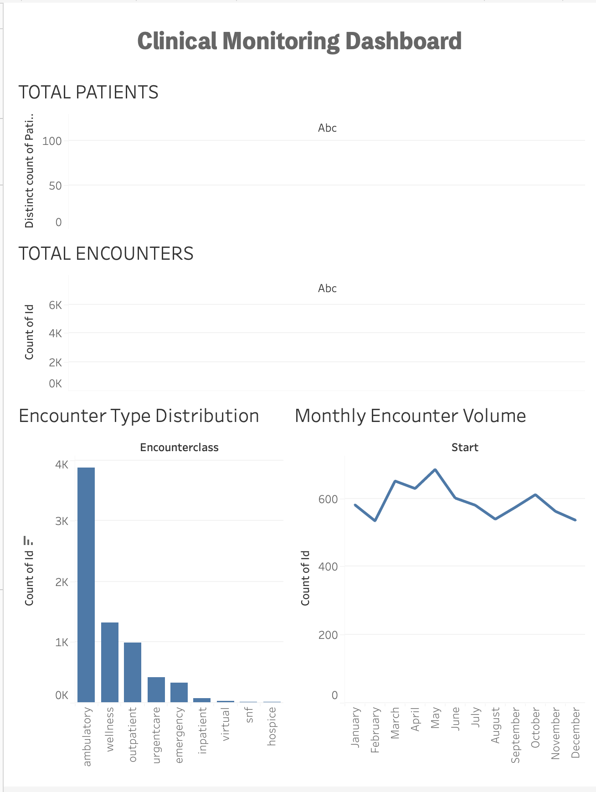

# Clinical Monitoring Dashboard

## Overview
This project focuses on monitoring key clinical and operational metrics using de-identified EHR data.  
The dashboard is designed to support healthcare decision-making by tracking patient volume, visit patterns, and encounter types.

## Tools
- SQL (SQLite)
- Tableau Public
- Excel
- GitHub

## Key Metrics Monitored
- Total patients
- Total encounters
- Encounter type distribution
- Monthly visit trends
- High-utilization encounter categories

## Dataset
Synthetic EHR data (HIPAA-safe) generated using Synthea.

## Deliverables
- KPI dashboard
- Trend visualizations
- Insight summary

## Dashboard Preview

